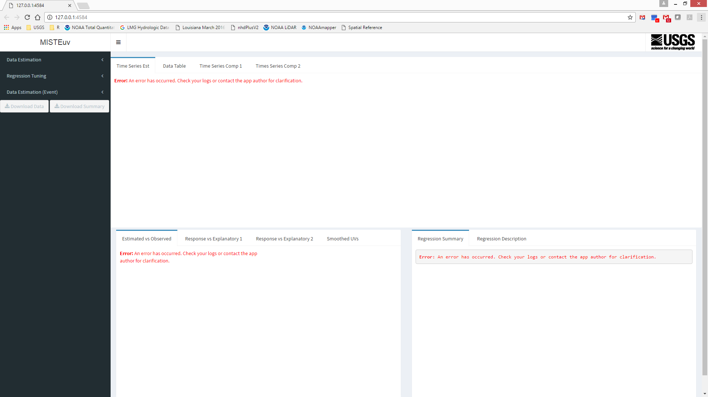
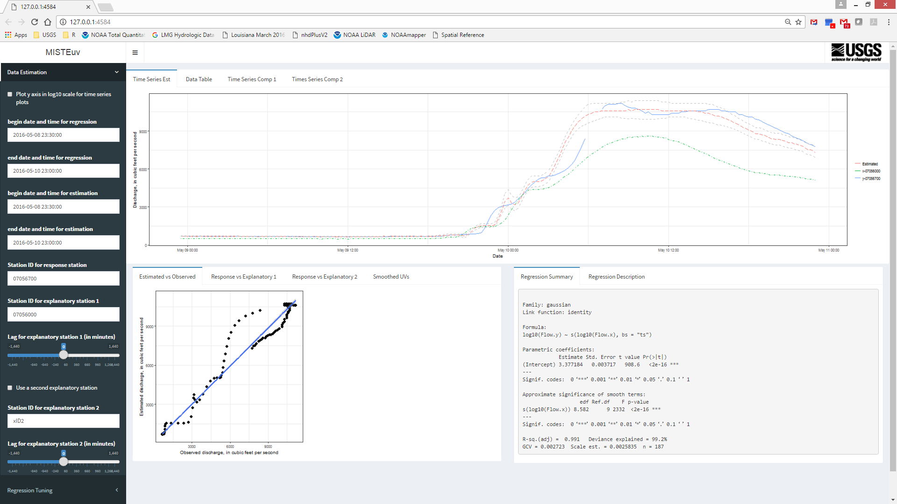
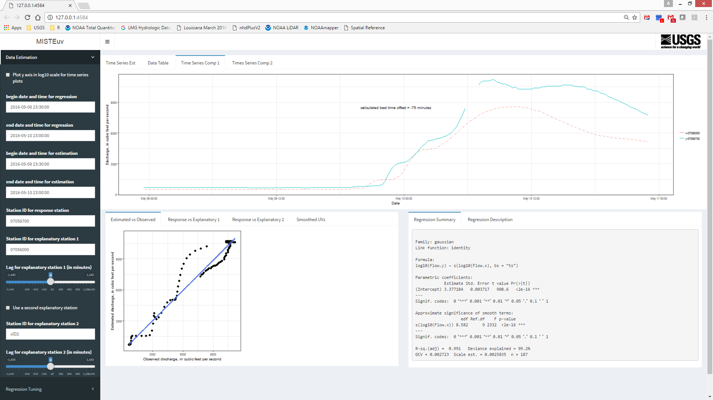
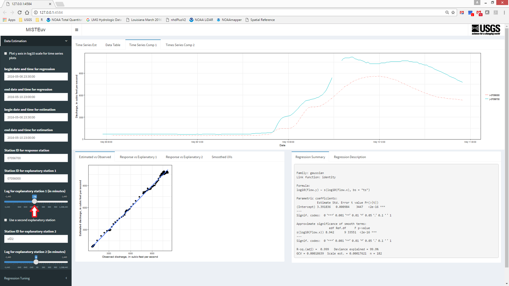
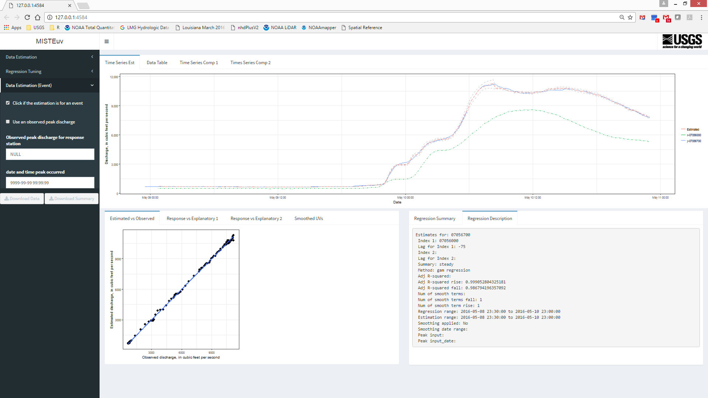
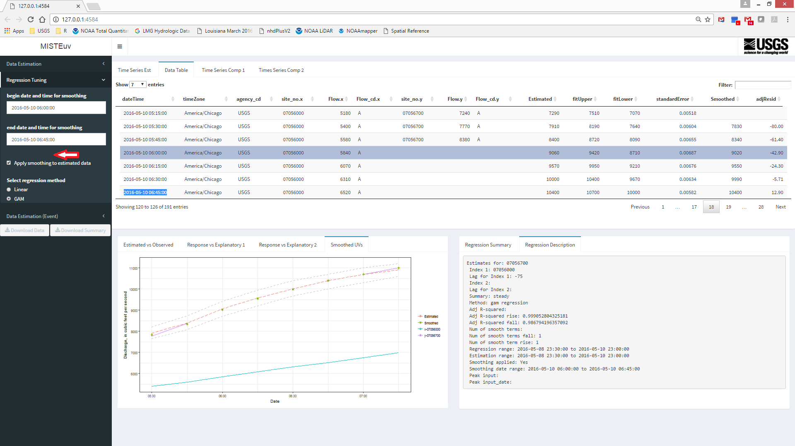
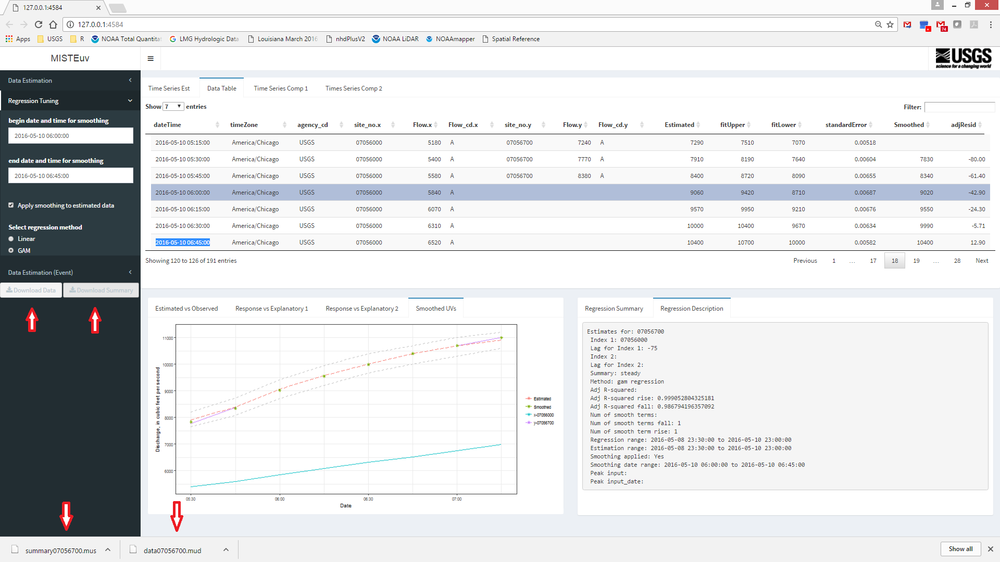

MISTEuv demo
================

When the web app is launched, error messages will appear.

Users can enter date ranges and IDs for USGS streamflow-gaging stations in order to begin estimating data.

After data is entered, click on the "Time Series Comp 1" tab.

The best time offset is printed on the graph. Use the slider to adjust the lag for the hydrographs on the screen.

Click on the "Time Series Est" tab to see the estimated data and associated confidence intervals. Click on the "Data Table" tab to see all of the data. Click on the "Response vs Explanatory 1" tab to see how data from the streamgages compares.

The time period selected for this example contains a runoff event. Click on the "Data Estimation (Event)" dropdown menu and select "Click if the estimation is for an event".

If the estimates produced don't "line up" well with the data around the missing period, smoothing can be applied.

Data can be exported using the download buttons.

